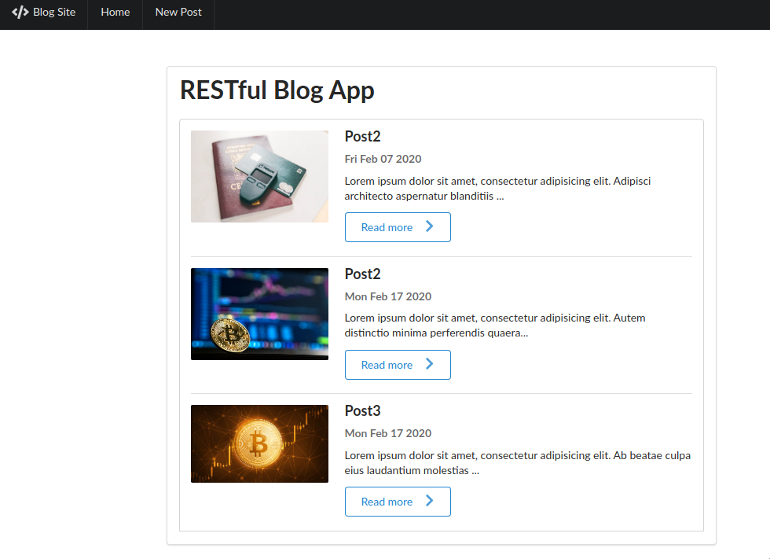
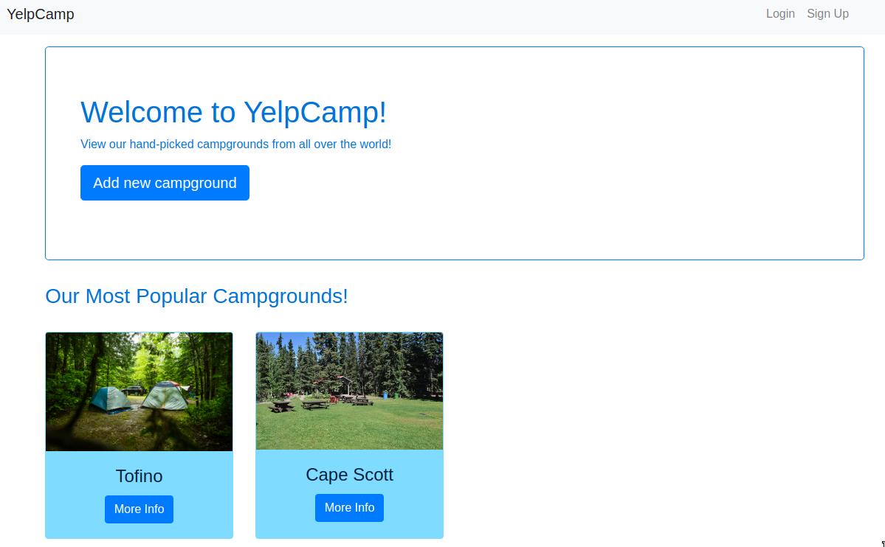
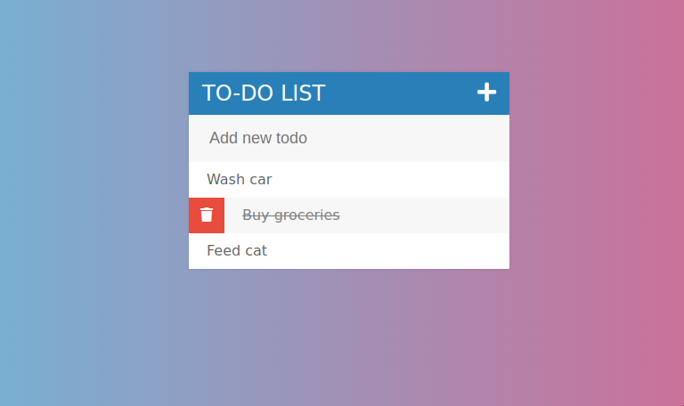
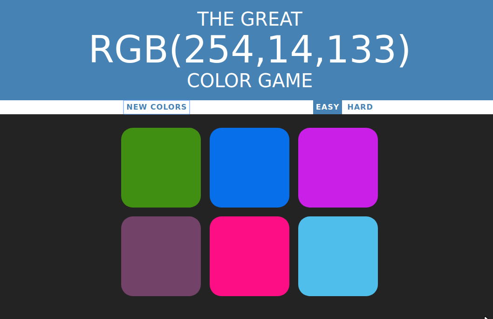

## Blog

Stack: Express, Mongo, Semantic UI, JavaScript

Includes functionality to create, update and delete blog entries using REST routes.

## Yelp clone (WIP)

Stack: Bootstrap, jQuery, Express, Mongo

Work in progress: Includes authentication and functionality to post, edit, delete posts using REST routes. 

## Audio + Visual Animation

Stack: PaperJs, Howler (JS libraries).

[Patatap](https://patatap.com/) clone.

## TO-DO List

 Stack: HTML, Bootstrap, jQuery.

 Web tool which allows to add, delete entries and mark them as completed.
 

## Color Guessing Game

Stack: HTML, Bootstrap, JavaScript.

Select the correct color given an rgb. 

